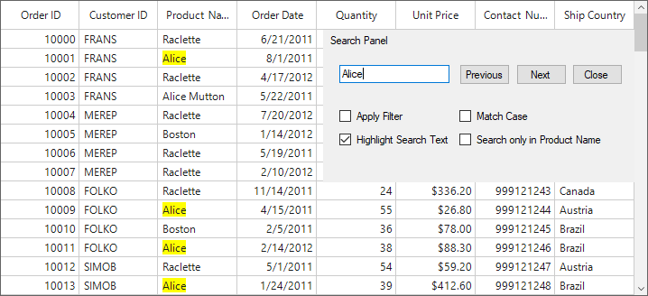

# How to search the whole word in WinForms DataGrid (SfDataGrid)?

## About the sample

This sample illustrates how to search the whole word in WinForms DataGrid.

In SfDataGrid, searching will be performed by contains search condition in the default SearchController. So that, all cell values which contains the search text will be highlighted. For example, if the search text is “Alice” and the DataGrid contains the values “Alice” and “Alice Mutton” in two different cells, the search text Alice in both the cells will be highlighted. 

We can change this behavior to highlight the cell only if the cell value is completely same as the search text. That is, only the cell with the text “Alice” will be highlighted. This can be achieved by creating a custom SearchController and apply Equals search instead of Contains search. 


```c#
public Form1()
{
    InitializeComponent();
    this.sfDataGrid1.SearchController = new CustomSearchController(sfDataGrid1);
}

public class CustomSearchController : SearchController
{
    public CustomSearchController(SfDataGrid dataGrid):base(dataGrid)
    {

    }
    protected override void HighlightSearchText(Graphics paint, DataColumnBase column, CellStyleInfo style, 
        Rectangle bounds, string cellValue, RowColumnIndex rowColumnIndex)
    {
        if (AllowHighlightSearchText && !string.IsNullOrEmpty(SearchText))
        {
            if (column != null && (SearchColumns.Count > 0 && !SearchColumns.Contains(column.GridColumn.MappingName)))
                return;

            var searchText = SearchText;
            string[] metaCharacters = { "\\", "^", "$", "{", "}", "[", "]", "(", ")", ".", "*", "+", "?", "|", "<", ">", "-", "&" };
            if (metaCharacters.Any(searchText.Contains))
            {
                for (int i = 0; i < metaCharacters.Length; i++)
                {
                    if (searchText.Contains(metaCharacters[i]))
                        searchText = searchText.Replace(metaCharacters[i], @"\" + metaCharacters[i]);
                }
            }

            searchText = "^(" + searchText + ")$";

            //Gets the list of indexes that match with the search text.
            List<int> matchList = Regex.Matches(cellValue, searchText, this.AllowCaseSensitiveSearch ? RegexOptions.None : RegexOptions.IgnoreCase)
                                            .Cast<Match>()
                                            .Select(s => s.Index).ToList();

            


            if (matchList.Count > 0 && bounds.Width > 0)
            {
                StringFormat format = new StringFormat(StringFormat.GenericDefault);

                List<CharacterRange[]> characterRangeList = new List<CharacterRange[]>();

                //Used 32 as CharacterRangeLength to avoid System.OverFlowExcepion 
                //in StringFormat.SetMeasurableCharacterRanges which occurs if the CharacterRange length is more than 32.
                int characterRangeLength = 32;
                int count = matchList.Count / characterRangeLength;
                int range = matchList.Count % characterRangeLength;
                int startIndex = 0;

                if (count > 0)
                {
                    for (int index = 0; index < count; index++)
                    {
                        CharacterRange[] characterRange = new CharacterRange[characterRangeLength];

                        for (int i = 0; i < characterRangeLength; i++)
                        {
                            characterRange[i] = new CharacterRange(matchList[startIndex], SearchText.Length);
                            startIndex++;
                        }

                        characterRangeList.Add(characterRange);
                        characterRange = null;
                    }
                }

                if (range > 0)
                {
                    CharacterRange[] characterRange = new CharacterRange[range];
                    for (int i = 0; i < range; i++)
                    {
                        characterRange[i] = new CharacterRange(matchList[startIndex], SearchText.Length);
                        startIndex++;
                    }

                    characterRangeList.Add(characterRange);
                    characterRange = null;
                }

                //VerticalAlignment
                format.LineAlignment = ConvertToStringAlignment(style.VerticalAlignment);

                //HorizontalAlignment
                format.Alignment = ConvertToStringAlignment(style.HorizontalAlignment);

                if (!column.GridColumn.AllowTextWrapping)
                {
                    format.FormatFlags = StringFormatFlags.NoWrap;
                    format.Trimming = column.GridColumn.TextTrimming;
                }

                if (DataGrid.RightToLeft == RightToLeft.Yes)
                    format.FormatFlags = StringFormatFlags.DirectionRightToLeft;

                foreach (var characterRange in characterRangeList)
                {
                    //Set the range of characters to be measured.
                    format.SetMeasurableCharacterRanges(characterRange);

                    //Gets the regions of the measurable characters applied to the string format for the given text with in the text bounds.
                    Region[] regions = paint.MeasureCharacterRanges(cellValue, style.GetFont(), bounds, format);

                    RectangleF[] fillRectangle = new RectangleF[regions.Length];
                    for (int i = 0; i < regions.Length; i++)
                        fillRectangle[i] = regions[i].GetBounds(paint);

                    var highlightColor = SearchColor;
                    if (this.CurrentRowColumnIndex == rowColumnIndex)
                        highlightColor = SearchHighlightColor;

                    // Highlights the search text based on the 
                    using (Brush brush = new SolidBrush(highlightColor))
                        paint.FillRectangles(brush, fillRectangle);
                }

                characterRangeList.Clear();
                characterRangeList = null;
                matchList.Clear();
                matchList = null;
            }
        }
    }

    private StringAlignment ConvertToStringAlignment(VerticalAlignment align)
    {
        switch (align)
        {
            case VerticalAlignment.Bottom: return StringAlignment.Far;
            case VerticalAlignment.Center: return StringAlignment.Center;
            default: return StringAlignment.Near;
        }
    }

    private StringAlignment ConvertToStringAlignment(HorizontalAlignment align)
    {
        switch (align)
        {
            case HorizontalAlignment.Right: return StringAlignment.Far;
            case HorizontalAlignment.Center: return StringAlignment.Center;
            default: return StringAlignment.Near;
        }
    }
}
```



## Requirements to run the demo
Visual Studio 2015 and above versions
